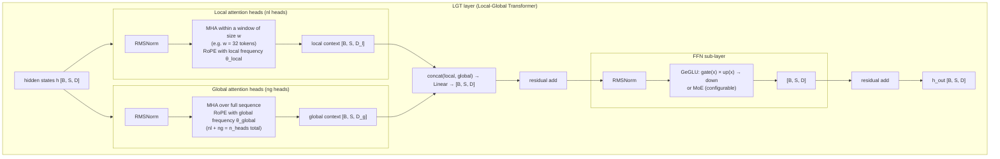
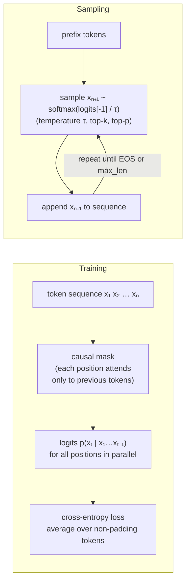
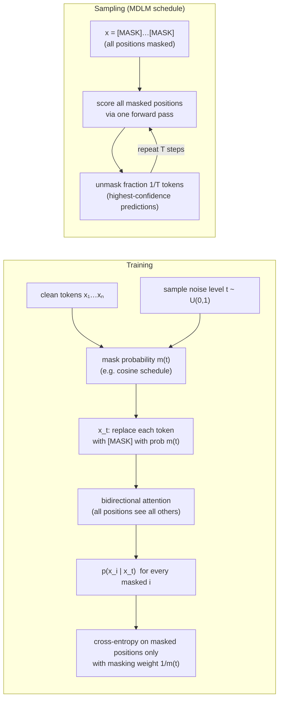
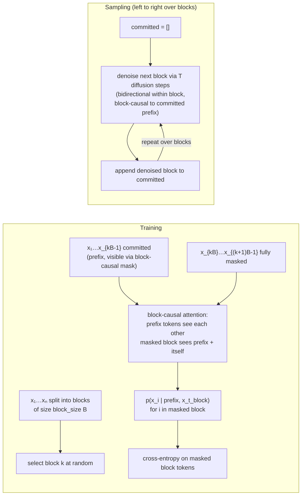
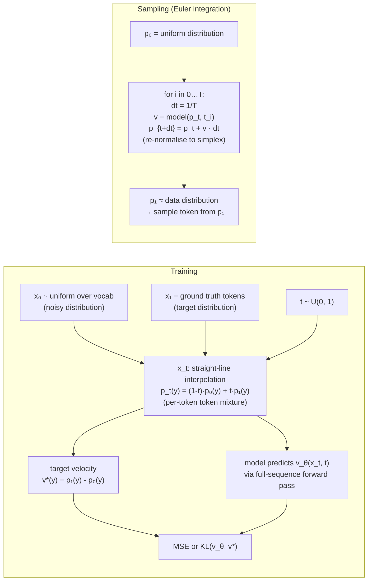
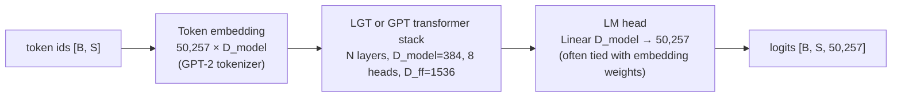
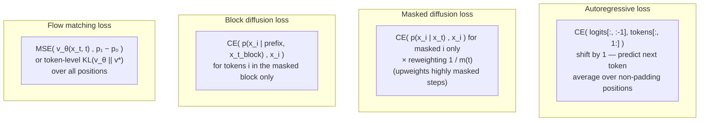
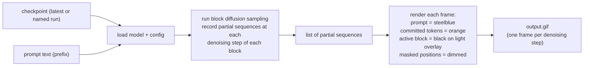
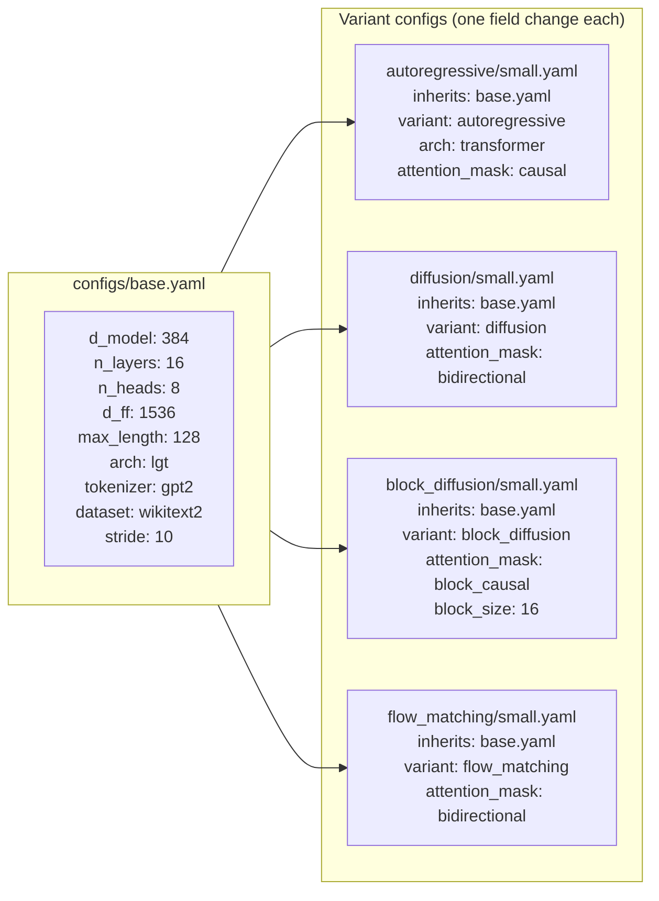

# Architecture

Mermaid diagrams (render on GitHub). See also the [project page](../project-page/index.html)
and the [README](../README.md) for a laymen overview.
For usage details, see [usage.md](usage.md) and [core.md](core.md).

---

## 1. Shared backbone — LGT transformer

All four generation paradigms run on the same Local-Global Transformer (LGT) or standard GPT backbone. Autoregressive uses GPT; all diffusion/flow variants use LGT because they need bidirectional context.

---

## 2. Four generation paradigms in detail

### 2a. Autoregressive (reference baseline)

### 2b. Masked diffusion (absorbing-state)

### 2c. Block diffusion

### 2d. Discrete flow matching

---

## 3. Token backbone — ids to logits

---

## 4. Loss functions

---

## 5. Visualiser — block diffusion GIF

---

## 6. Config inheritance and variant switching

