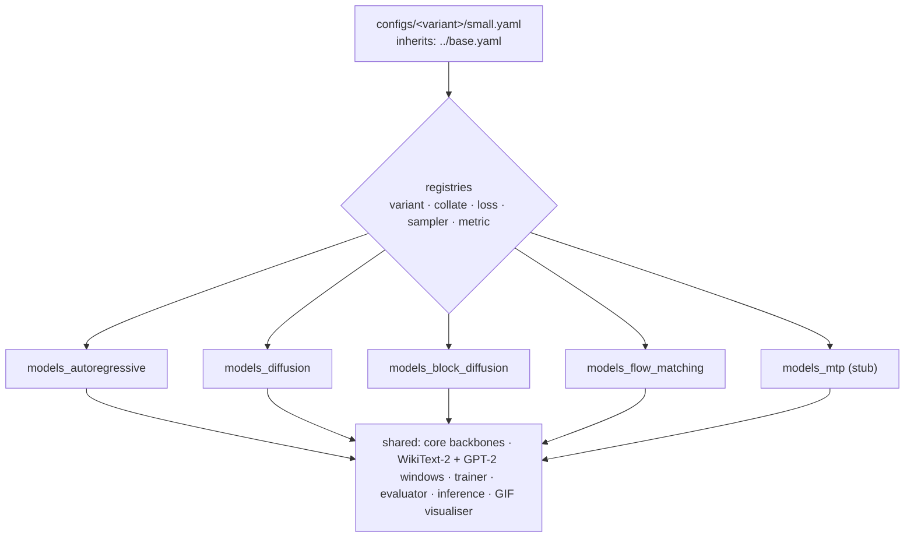
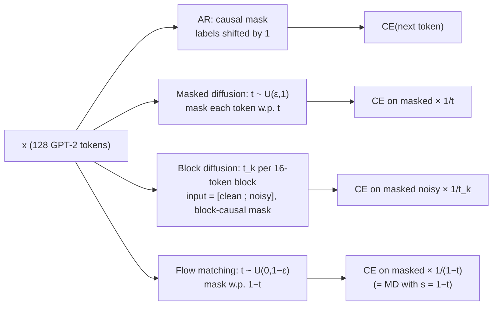
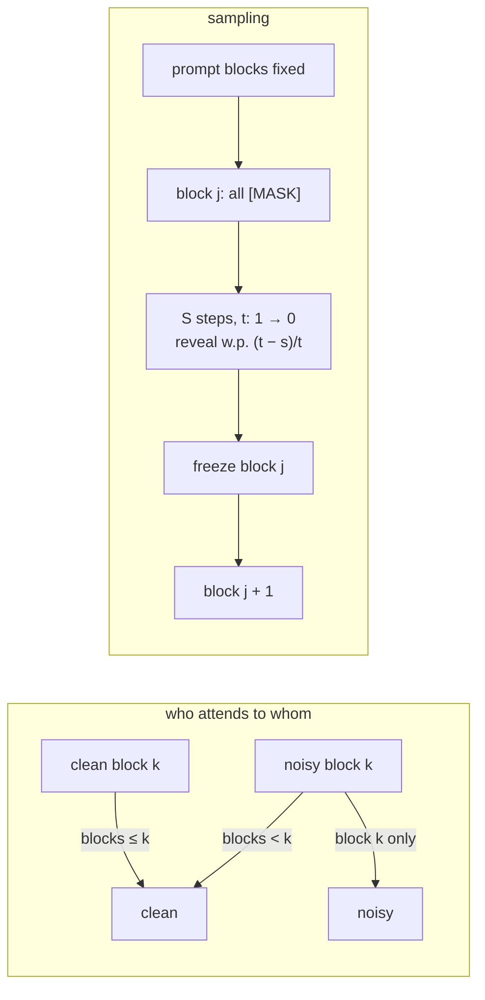
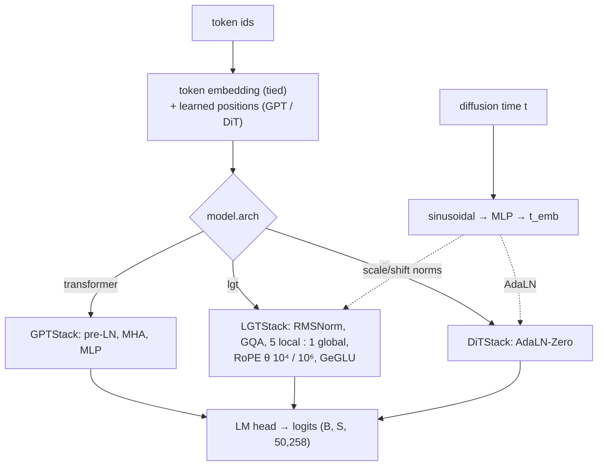

# Architecture

Mermaid diagrams (they render on GitHub). They match the [paper](../paper/main.tex) and the
[project page](../project-page/index.html).

## 1. Paradigms as plugins

## 2. Training objectives

## 3. Block diffusion: attention and decoding

## 4. Shared backbone

## Sizes (measured, `configs/base.yaml`)

| Paradigm | Backbone | Params |
|---|---|---|
| AR | GPT, MLP, MHA | 47.7M |
| Diffusion / block diffusion / flow matching | LGT, GeGLU, GQA n_kv = 2, time-conditioned | 63.2M |
