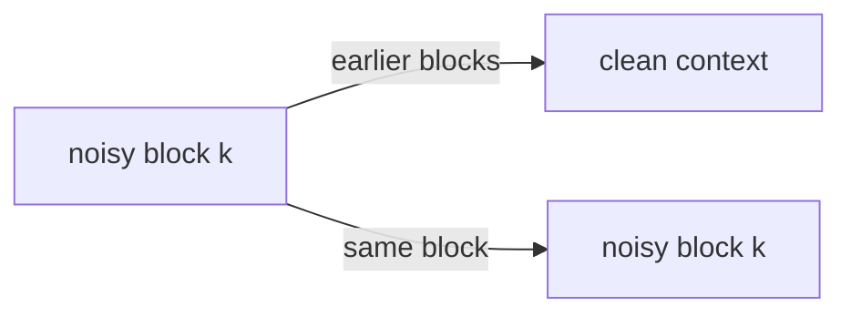

# Same model, four ways to write: AR, masked diffusion, block diffusion and flow matching

*2026-09-28 · B A NaveenKumar*

> **Summary.** HALE-LLM trains four kinds of language model with the same transformer, the
> same tokenizer, the same data and the same metrics: left-to-right next-token prediction,
> masked diffusion, block diffusion and discrete flow matching. Only the corruption, the loss
> weight and the sampler change. Along the way it becomes clear that two of the four are the
> same thing written differently.

## Why hold everything else fixed?

Papers comparing diffusion LMs to autoregressive ones usually change the backbone, the
tokenizer, the data pipeline and the evaluation along with the objective. HALE-LLM makes
the **paradigm a plugin**: a folder with a model wrapper, a collate function, a loss and a
sampler, registered by name. Everything else is shared, so a comparison is a one-line
change to `variant:`.

## The four objectives, as implemented

| Paradigm | Corrupt | Loss |
|---|---|---|
| Autoregressive | none; causal mask | cross-entropy on the next token |
| Masked diffusion | mask each token with prob `t ~ U(ε, 1)` | CE on masked tokens × **1/t** |
| Block diffusion | a separate `t` per 16-token block | CE on masked tokens of the noisy copy × **1/t_block** |
| Flow matching | mask each token with prob `1 − t` | CE on masked tokens × **1/(1 − t)** |

The `1/t` factor is not a heuristic: with the linear schedule `α_t = 1 − t`, the
continuous-time ELBO of absorbing-state diffusion weights each masked token's
cross-entropy by `−α'_t / (1 − α_t) = 1/t`. Rarely masked sequences (small `t`) are easy but
count for more.

## Two of these are the same model

Look at the flow-matching row and substitute `s = 1 − t`. The masking probability becomes
`s`, and the weight becomes `1/s`. That's exactly masked diffusion, run with time going the
other way. With a linear masking path, discrete flow matching and MDLM-style masked
diffusion are the same objective. HALE-LLM keeps both plugins because the flow version is
where non-linear or non-masking paths would diverge, but any experiment comparing the two
as they stand should expect identical behaviour up to noise.

## Block diffusion: the interesting middle

Block diffusion generates 16 tokens at a time. Within a block it denoises in parallel like
a diffusion model, and across blocks it moves left to right like an AR model. Training
needs a special attention pattern. The model sees the **clean** sequence and a **noisy** copy
side by side (256 tokens for a 128-token window), and:

- clean tokens see clean tokens in their own and earlier blocks;
- noisy tokens see clean tokens from **strictly earlier** blocks, and noisy tokens in their own block.

At sampling time, earlier blocks are frozen, and the current block starts fully masked and
is revealed over `sampling_steps` steps. The GIF at the top shows exactly this: prompt in
blue, finished blocks in orange, the active block highlighted.

## Honest status

The GIF is from step 4,900 of a small model trained on WikiText-2. The words look like
WikiText, including its odd `@-@` tokens, but the sentences aren't coherent yet. The
testbed is ready: shared metrics (bits per token, perplexity as an ELBO bound for the
diffusion family, masked accuracy), per-run experiment folders and GIFs. The controlled
comparison is the next step. Also on the list: finishing the multi-token prediction
variant (the extra heads exist but aren't trained yet) and porting three unit tests that
still import the project's old package name.

Code, paper and diagrams:
[github.com/basaanithanaveenkumar/Hale-LLM](https://github.com/basaanithanaveenkumar/Hale-LLM).
